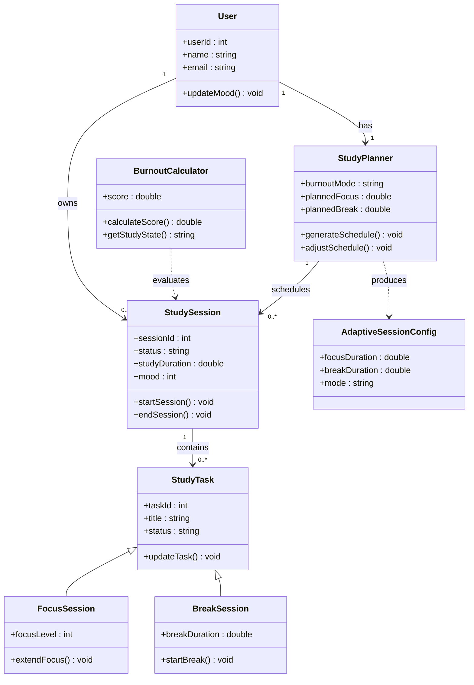

<p align="center">
  
</p>

<h1 align="center">Cognitive Sanctuary</h1>

<p align="center">


</p>

**The Cognitive Sanctuary** is a minimalist, high-performance smart study planner designed to optimize deep work sessions and prevent student burnout. Built with a mindful aesthetic, it features adaptive scheduling, burnout risk detection, and a focused environment for maximum cognitive efficiency.

---

## ✨ Features

- **Mindful Dashboard:** A clean overview of your study status, KPI tracking (Study Hours, Breaks, Mood), and a real-time Burnout Risk gauge.
- **Adaptive Scheduling:** Intelligent task management that separates "Priority Focus" from "Rest Mode" based on your current cognitive load.
- **Session Configuration:** Personalize your deep work environment with mental state selectors and burnout prediction modeling.
- **Data Visualization:** Integrated Recharts to visualize your "Cognitive Focus Flow" and engagement trends.
- **Premium Design:** A minimalist "Forest Green" aesthetic with smooth animations powered by Framer Motion.

---

## 🛠️ Tech Stack

### Frontend
- **Framework:** [React](https://reactjs.org/) (via [Vite](https://vitejs.dev/))
- **Styling:** [Tailwind CSS](https://tailwindcss.com/)
- **Icons:** [Lucide React](https://lucide.dev/)
- **Animations:** [Framer Motion](https://www.framer.com/motion/)
- **Charts:** [Recharts](https://recharts.org/)
- **Routing:** [React Router DOM](https://reactrouter.com/)

### Backend

- **Framework:** ASP.NET Core Web API (C#)

---

<details>

<summary>

## 🧩 Simplified UML Diagram

</summary>



</details>

---

## 🚀 Getting Started

Follow these instructions to get the project up and running on your local machine.

### Prerequisites

- [Node.js](https://nodejs.org/) (LTS recommended)
- [.NET SDK](https://dotnet.microsoft.com/download) (8.x recommended)

### Installation

1. **Clone the repository:**
   ```bash
   git clone <your-repository-url>
   cd cognitive-sanctuary
   ```

### Frontend Setup (React)

1. **Install dependencies:**

   ```bash
   cd frontend
   npm install
   ```

2. **Run the dev server:**
   ```bash
   npm run dev
   ```

The frontend will be available at `http://localhost:5173` (or the next available port).

### Backend Setup (ASP.NET Core)

1. **Restore and run the API:**
   ```bash
   cd backend/CognitiveSanctuaryAPI
   dotnet restore
   dotnet run
   ```

The backend will run on the URLs shown in the terminal output (typically `https://localhost:7xxx`).

---

## 📂 Project Structure

```
root/
   frontend/
      src/
         components/ui/
         components/layout/
         pages/
         data/mockData.js
      public/
      package.json
      vite.config.js
      tailwind.config.js
   backend/
      CognitiveSanctuaryAPI/
         Program.cs
         appsettings.json
```

Frontend paths:

- `frontend/src/components/ui/`: Reusable primitive components (Button, Card, Badge).
- `frontend/src/components/layout/`: Global layout components (Sidebar, Topbar, Layout).
- `frontend/src/pages/`: Individual page implementations (Dashboard, Schedule, Sessions, Login).
- `frontend/src/data/mockData.js`: Centralized static data for frontend prototyping. Easily swappable for API calls.

---

## 🛠️ Developer Notes

- **Animations:** All complex staggered animations have been simplified to a single-entry fade-in to ensure high performance and zero lag on all devices.
- **Styling:** The project uses a custom Tailwind color palette (`sanctuary-50` through `sanctuary-950`) defined in `frontend/tailwind.config.js`.
- **Responsive:** The layout is designed to be responsive, centering content within a standard container for a balanced desktop experience.

---

## 🧠 Philosophy

The Cognitive Sanctuary is built on the principle of **Mindful Productivity**. Instead of just counting hours, the app tracks cognitive load and energy levels to ensure that students work when they are most capable and rest when they are most vulnerable to burnout.

## 👥 Credits

Developed by Cognitive Sanctuary Team:
- Claire Nicole Bay
- Jyvhan Earl Ponce
- Richard Crue Torres

Inspired by mindful productivity research and cognitive load theory.
