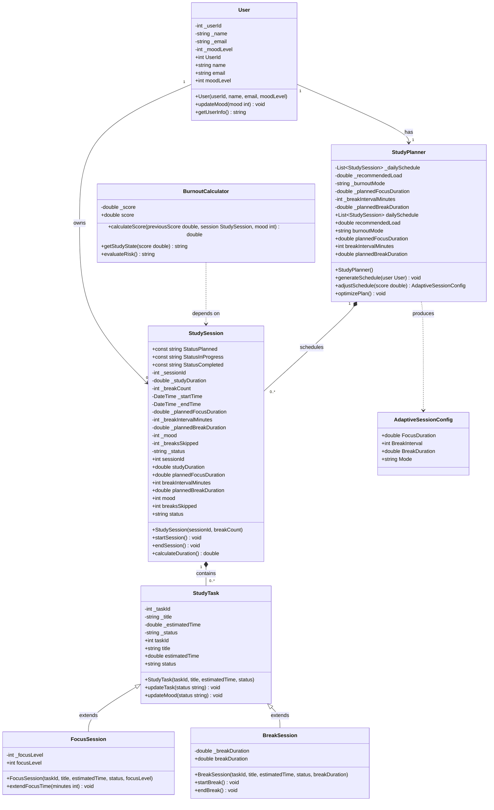

# Cognitive Sanctuary — Models UML & OOP Pillars

---

## UML Class Diagram



---

## Relationship Legend

| Symbol | Meaning | Example in Project |
|---|---|---|
| `<\|--` | **Inheritance** (IS-A) | `FocusSession` IS-A `StudyTask` |
| `*--` | **Composition** (owns, lifecycle tied) | `StudySession` owns `StudyTask` list |
| `-->` | **Association** (has a reference) | `User` has a `StudyPlanner` |
| `..>` | **Dependency** (uses as parameter) | `BurnoutCalculator` takes a `StudySession` |

### Cardinality at a Glance

| Relationship | Multiplicity | Optional / Mandatory |
|---|---|---|
| `User` → `StudySession` | `1` to `0..*` | Optional — user may have zero sessions |
| `User` → `StudyPlanner` | `1` to `1` | **Mandatory** — every user must have a planner |
| `StudyPlanner` → `StudySession` | `1` to `0..*` | Optional — schedule can be empty |
| `StudySession` → `StudyTask` | `1` to `0..*` | Optional — session can have no tasks added |
| `StudyTask` → `FocusSession` | Inheritance | One specific subtype |
| `StudyTask` → `BreakSession` | Inheritance | One specific subtype |

---

## The Four OOP Pillars

---

### 🔒 1. Encapsulation
> *"Bundle data and the methods that operate on it into a single unit, and restrict direct access to internal state."*

Every Model class uses **private backing fields** (`_name`, `_moodLevel`, etc.) and exposes them only through controlled **properties** with `get` and `private set`. State can only be changed through dedicated methods.

**Real example — `User.cs`:**
```csharp
// Private backing field — nobody outside can touch this directly
private int _moodLevel;

// Controlled property — anyone can READ it, but only this class can WRITE it
public int moodLevel
{
    get { return _moodLevel; }
    private set { _moodLevel = value; }
}

// The only way to change mood from outside — goes through a method
public void updateMood(int mood)
{
    _moodLevel = mood;
}
```

**Why this matters:** Without encapsulation, any part of the code could set `_moodLevel = -500`, which would produce a nonsensical burnout score. Encapsulation creates a protective boundary — external code can only update mood through `updateMood()`, where we can add validation in the future without touching any other file.

---

### 🧬 2. Inheritance
> *"A child class inherits all properties and methods of a parent class, then adds or specializes what is unique to itself."*

`FocusSession` and `BreakSession` are both types of tasks inside a study session. Instead of duplicating `taskId`, `title`, `estimatedTime`, and `status` in both classes, they **inherit** from `StudyTask` and only define what makes them different.

**Real example:**
```csharp
// PARENT — shared fields for all task types
public class StudyTask
{
    private int _taskId;
    private double _estimatedTime;
    private string _status;
    // ...
    public void updateTask(string status) { _status = status; }
}

// CHILD 1 — adds focusLevel and time extension
public class FocusSession : StudyTask
{
    private int _focusLevel;

    public FocusSession(int taskId, string title, double estimatedTime, string status, int focusLevel)
        : base(taskId, title, estimatedTime, status) // calls parent constructor
    {
        _focusLevel = focusLevel;
    }

    public void extendFocusTime(int minutes)
    {
        estimatedTime += minutes; // uses inherited property from StudyTask
    }
}

// CHILD 2 — adds breakDuration and break lifecycle methods
public class BreakSession : StudyTask
{
    private double _breakDuration;

    public void startBreak() { status = "On Break"; } // inherited property
    public void endBreak()   { status = "Active"; }
}
```

**Inheritance Hierarchy:**
```
StudyTask          ← parent (taskId, title, estimatedTime, status, updateTask)
├── FocusSession   ← child 1 (adds: focusLevel, extendFocusTime)
└── BreakSession   ← child 2 (adds: breakDuration, startBreak, endBreak)
```

---

### 🎭 3. Polymorphism
> *"The same interface or method call behaves differently depending on the actual object type at runtime."*

**In the Services layer — Interface Polymorphism:**

Controllers are programmed against **Interfaces**, not concrete classes. .NET injects the real implementation at runtime — the controller never needs to know which specific class it is using.

```csharp
// INTERFACE — only declares what must exist
public interface InterfaceStudySessionService
{
    Task<StudySession> CreateSessionAsync(int userId);
    Task CompleteSessionAsync(int sessionId, ...);
}

// CONTROLLER — works with the interface only
public class SessionsController
{
    private readonly InterfaceStudySessionService _service;

    public SessionsController(InterfaceStudySessionService service)
    {
        _service = service; // real implementation injected by .NET DI at startup
    }
}
```

**In the Models layer — Subtype Polymorphism:**

A `StudySession` can hold any list of `StudyTask` objects — whether they are `FocusSession` or `BreakSession` instances, the code treats them the same way:

```csharp
List<StudyTask> tasks = new List<StudyTask>();
tasks.Add(new FocusSession(...)); // is-a StudyTask ✅
tasks.Add(new BreakSession(...)); // is-a StudyTask ✅

foreach (StudyTask t in tasks)
{
    t.updateTask("Completed"); // same call, works on both types
}
```

---

### 🧩 4. Abstraction
> *"Hide complex internal logic and expose only a simple, clean interface to the outside world."*

`BurnoutCalculator` hides all the scoring math (mood delta, break penalty, clamping to 0–100). The caller just passes in a session and mood value and gets back a score — no knowledge of the algorithm required.

**Real example — `BurnoutCalculator.cs`:**
```csharp
public class BurnoutCalculator
{
    private double _score;

    // All complexity is HIDDEN inside here
    public double calculateScore(double previousScore, StudySession session, int mood)
    {
        double moodDelta = mood switch
        {
            1 => -5,  // Happy  → lowers burnout
            2 => -3,  // Neutral
            3 =>  5,  // Tired  → raises burnout
            4 => 10,  // Exhausted → spikes burnout
            _ =>  0
        };

        double breakPenalty = session.breaksSkipped * 2; // skipping breaks adds pressure

        _score = previousScore + moodDelta + breakPenalty;
        if (_score < 0)   _score = 0;   // clamp to valid range
        if (_score > 100) _score = 100;

        return _score;
    }

    // Simple labels — caller doesn't need to know the thresholds
    public string getStudyState(double score)
    {
        if (score <= 25) return "Optimal";
        if (score <= 50) return "Balanced";
        if (score <= 75) return "Paced";
        return "Recovery";
    }

    public string evaluateRisk()
    {
        if (_score <= 50) return "Safe";
        if (_score <= 75) return "Warning";
        return "High Risk";
    }
}
```

**`StudyPlanner.adjustSchedule()` is also pure abstraction:**
```csharp
// Caller just passes a burnout score — all threshold logic is hidden inside
AdaptiveSessionConfig config = planner.adjustSchedule(burnoutScore);

// Returns ready-to-use values:
// config.FocusDuration → 25 / 35 / 40 / 45 mins
// config.BreakDuration → 20 / 15 / 10 mins
// config.Mode         → "Recovery" / "Paced" / "Balanced" / "Optimal"
```

---

## OOP Pillars Summary Table

| Pillar | Where Applied in Project | What It Achieves |
|---|---|---|
| **Encapsulation** | All Models: `User`, `StudySession`, `StudyTask`, `StudyPlanner`, `BurnoutCalculator` | Private fields + `private set` prevent invalid state from outside |
| **Inheritance** | `FocusSession` and `BreakSession` both extend `StudyTask` | Eliminates duplication of shared task fields; child classes only add what's unique |
| **Polymorphism** | Service Interfaces (`InterfaceStudySessionService`, etc.) + `StudyTask` list holding subtypes | Controllers stay decoupled; any task type can be stored and operated on uniformly |
| **Abstraction** | `BurnoutCalculator.calculateScore()`, `StudyPlanner.adjustSchedule()` | Complex algorithms hidden behind simple method calls; callers only see inputs and outputs |
